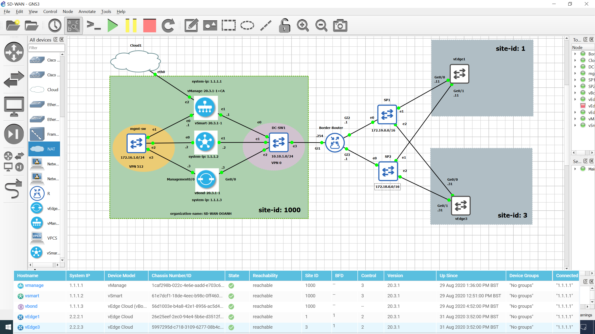
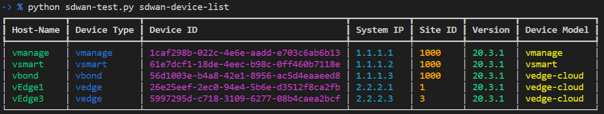
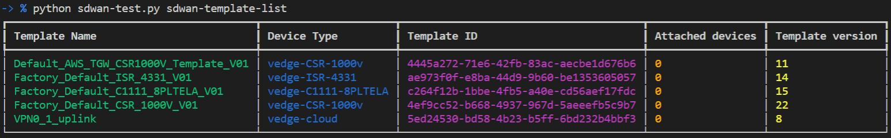
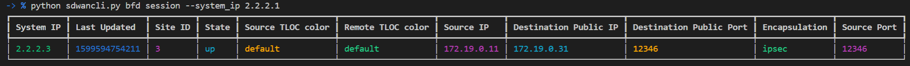
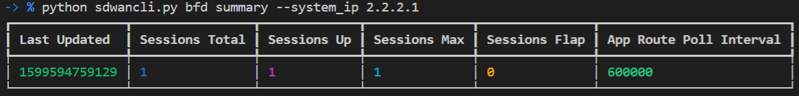
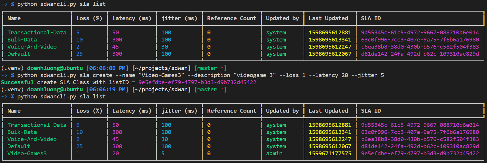
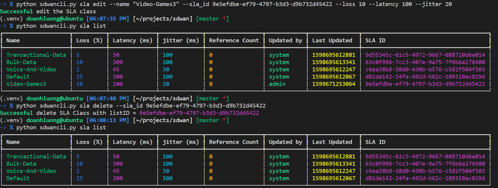
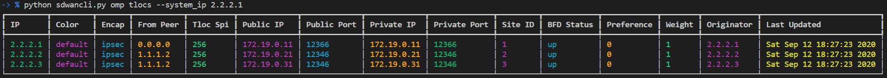

# sdwan-python-rest-api

[](https://developer.cisco.com/codeexchange/github/repo/kimdoanh89/sdwan-python-rest-api)

## SD-WAN 20.3.1

This public repo contains python code that can be used to interact with the Cisco SD-WAN vManage REST API. The environment is pre-configured to access my local SD-WAN lab in GNS3. 

You can edit the variables in the `vmanage/constants.py` to point to your own vManage instance, the AlwaysOn SDWAN Sandbox, or the Reservable
SDWAN Sandbox.

**Note:** When you use the AlwaysOn Sandbox, you do not have permission to perform
some commands such as `edit`, `create`, `delete`.


### Topology



## Current functions
The code contains REST API calls to authenticate and interact with Cisco SD-WAN vManage 20.3.1. Currently, it supports the following functions:
```bash
-> % sdwancli
Usage: sdwancli [OPTIONS] COMMAND [ARGS]...

  Command line tool to interact with CISCO SDWAN vManage.

Options:
  --help  Show this message and exit.

Commands:
  bfd       Commands to monitor bfd sessions: link --state, summary, session
  control   Commands to monitor control plane: connections,...
  device    Commands to see details of device: list
  ipsec     Commands to monitor ipsec: outbound-connections,...
  omp       Commands to monitor omp: tlocs, tloc-paths
  sla       Commands for managing SLA Class: list, create, edit, delete
  template  Commands to manage Device and Feature Templates: list, show,...
```

And for each command, it supports some subcommands, for example, `template` command:

```bash
-> % sdwancli template
Usage: sdwancli template [OPTIONS] COMMAND [ARGS]...

  Commands to manage Device and Feature Templates: list, show, create,
  delete

Options:
  --help  Show this message and exit.

Commands:
  device   Manage Device Templates: list, show, create, delete
  feature  Manage Feature Templates: list, show, create, delete
```

Another `bfd` command has following subcommands:

```bash
-> % sdwancli bfd
Usage: sdwancli bfd [OPTIONS] COMMAND [ARGS]...

  Commands to monitor bfd sessions: link --state, summary, session

Options:
  --help  Show this message and exit.

Commands:
  link      Get list of bfd links with status: up or down
  sessions  Show BFD sessions at a device
  summary   Show BFD summary of a device
```

You can access the help of each subcommand to know about the arguments using 
`sdwancli {command} {subcommand} --help`, for example:

```bash
-> % sdwancli sla create --help
Usage: sdwancli sla create [OPTIONS]

  Create a SLA Class

Options:
  --name TEXT         name of the SLA Class
  --description TEXT  description of the SLA Class
  --loss TEXT         loss 0 - 100 %
  --latency TEXT      latency 1 - 1000 ms
  --jitter TEXT       jitter 1 - 1000 ms
  --help              Show this message and exit.
```

## Requirements

To use this code you will need:

- Python 3.8+
- vManage user login details. (User should have privilege level to configure policies)

## Install and Setup
Clone the code to local machine.
```bash
git clone https://github.com/kimdoanh89/sdwan-python-rest-api
cd sdwan-python-rest-api
```

Setup Python Virtual Environment (requires Python 3.8+)
```bash
python3.8 -m venv venv
source venv/bin/activate
pip install -r requirements.txt
pip install -e .
```
A .py file with the Cisco SD-WAN credentials has been created in `vmanage/constants.py`. You can edit the variables in the file to point to your own vManage instance.

## Outputs
### Device list

```bash
sdwancli device list
```



### Template list, show, delete

```bash
sdwancli template list
sdwancli template show --template_id cb81c4d1-110b-4f33-9925-bf4889129019
sdwancli template delete --template_id cb81c4d1-110b-4f33-9925-bf4889129019
```


### BFD sessions monitor

```bash
sdwancli bfd link --state up
sdwancli bfd link --state down
```


```bash
sdwancli bfd session --system_ip 2.2.2.1
```




```bash
sdwancli bfd summary --system_ip 2.2.2.1
```



### SLA Class manager
#### SLA list and create

```bash
sdwancli sla list
sdwancli sla create --name "Video-Games3" --description "videogame 3" --loss 1 --latency 20 --jitter 5
```



#### SLA edit and delete
```bash
sdwancli sla edit --name "Video-Games3" --sla_id 9e5efdbe-ef79-4797-b3d3-d9b732d45422 --loss 10 --latency 100 --jitter 20
sdwancli sla delete --sla_id 9e5efdbe-ef79-4797-b3d3-d9b732d45422
```



### OMP monitor
#### omp tlocs
```bash
sdwancli omp tlocs --system_ip 2.2.2.1
```



#### omp tloc-paths
```bash
sdwancli omp tloc-paths --system_ip 2.2.2.1
```
```bash
tloc-paths entries 2.2.2.1 default ipsec
tloc-paths entries 2.2.2.2 default ipsec
tloc-paths entries 2.2.2.3 default ipsec
```

### Trouble shooting commands

| vEdge commands                   | Sdwancli commands                                        |
|----------------------------------|----------------------------------------------------------|
| show control connections         | sdwancli control connections --system_ip 2.2.2.1         |
| show control connections-history | sdwancli control connections-history --system_ip 2.2.2.1 |
| show bfd sessions                | sdwancli bfd sessions --system_ip 2.2.2.1                |
| show omp tlocs                   | sdwancli omp tlocs --system_ip 2.2.2.1                   |
| show omp tloc-paths              | sdwancli omp tloc-paths --system_ip 2.2.2.1              |
